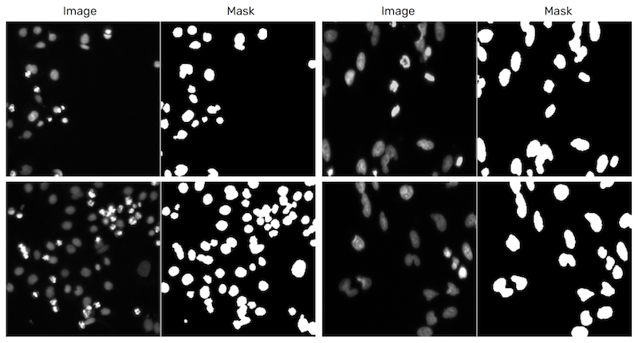

# Spotting Nuclei

Train a u-net model (implemented in Keras) for the 2018 Data Science Bowl [image segmentation challenge](https://www.kaggle.com/c/data-science-bowl-2018), as a proof of concept.

Example predictions:



Training:
```
python bowl.py --mode=train --epochs=50
```

Prediction:
```
python bowl.py --mode=test --checkpoint=checkpoint.50.h5
```

Data ([download from the Kaggle website](https://www.kaggle.com/c/data-science-bowl-2018/data)):
```
data/
  stage1_test/
    0a849e0eb15faa8a6d7329c3dd66aabe9a294cccb52ed30a90c8ca99092ae732/
      images/
    ...
  stage1_train/
    0a7d30b252359a10fd298b638b90cb9ada3acced4e0c0e5a3692013f432ee4e9/
      images/
      masks/
    ...
```
